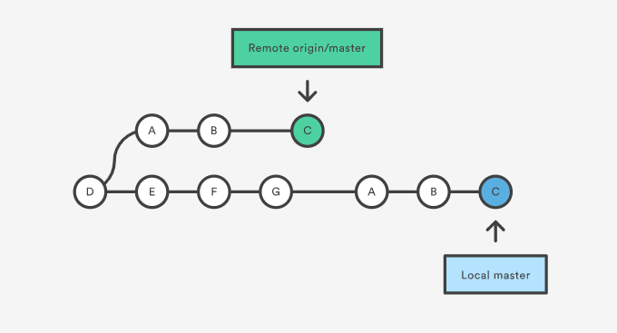

# git-learn

dummy repo to learn advance git commands

## Working Areas:

- Working directory(working copy/working tree) : This is your local directory where you make the project (write code) and make changes to it.
- Staging Area (aka index/cache/stage) : this is an intermediate area where you first need to put your project before committing. This is used to logically group changes and collect them before committing.
- Local Repository : this is your local repository where you commit changes to the
  project before pushing them to central repository on Github. This is what is provided by distributed version control system. This corresponds to the .git folder in our directory.
- Central Repository(aka remote repository/remote) : This is the repository on the central server, which can be forked,cloned by anyone and update/change by the contributors/author.

## States of any file:

- Unmodified: simply means that you haven’t changed this file since your last commit.
- Modified is simply the opposite of that: Git sees that you’ve modified this file in
  some fashion since your last commit.
- Staged

**Git tracks only the files and not directories, it can easily rework the directory structure from its files**
For ex: by tracking the files:
main/ideas/idea1.txt
main/ideas/idea2.txt
main/videos/video1.txt
It can make out the directories main,ideas and videos

## to track empty directories:

- add a file to the directory
- placeholder file: .keep

## Seing difference

- git diff - shows difference bw the working copy and the copy staged for commit. /Confirm:_if no staged changes then bw the working copy and the HEAD_/
- git diff --staged - shows differnces bw the stage and the last commit(HEAD)

## Log

- git log: history of repo in reverse chronological order
- git log -p / git log --patch : history along with diff

## Reset

- git reset HEAD <filename/directory>: restore the staging area to the point as it was at HEAD but only effect the given filename/directory - keep s the changes

- git checkout HEAD <filename/directory>: restore the files in the working directory to the state as it was at HEAD

## Tips:

#### Renaming/Moving Files:

- git mv instead of plain mv. Doing plain mv - git will see it as delete at origin and create at destination, then we've to add to stage and then commit . Better way is git mv, it will see it as rename and now we've to just commit the changes.

#### Deleting files:

- git rm instead of plain rm. we will need to add the changes and commit them in case of plain rm but we can do it in one swoop using git rm.

## What is HEAD?

- reference ot the most recent commit in ur current branch(in most cases)

#### Fact:

Open the HEAD file in editor and there it will show what it is pointing to currently or run

- cat .git/HEAD

  HEAD is YOU
  HEADis a symbolic reference pointing to wherever you are in your commit history. It follows you wherever you go, whatever you do, like a shadow. If you make a commit, HEAD will move. If you checkout something, HEAD will move. Whatever you do, if you have moved somewhere new in your commit history, HEAD has moved along with you. To address one common misconception: you cannot detach yourself from HEAD. That is not what a detached HEAD state is. If you ever find yourself thinking: "oh no, i'm in detached HEAD state! I've lost my HEAD!" Remember, it's your HEAD. HEAD is you. You haven't detached from the HEAD, you and your HEAD have detached from something else.

  To see where the head is:
  git show HEAD
  Instead of referencing commits by their hash,We can refer to them using HEAD if not in detached state:
  HEAD->latest commit
  HEAD~1 -> second last commit(refer it as head-1) and so on

## Checkout a commit

- git checkout -commithash- -> Now the head is in detached state
- git checkout master/any_branch -> Head will point to tip in that branch

## Creating a local repository:

- from scratch(two ways)::no work done on the project till now:
  - 1st on local system and then on github
  - 1st on github and then on local system
- from existing:
  - from your own existing system files
  - from others repo
    - you are a collaborator
    - you have no access

**git init**:

## Creating a remote repository:

## Connecting local repository to remote repository

## Adding/Staging Files:

- git add file-name
- **git add .**: adds all files to staging area
- **git add a.txt b.txt c.txt**: adds the given files

## Unstaging files(*):

- git reset -- <path>
- git restore: made changes to files>not staged>git restore>undo the changes
- git restore --staged : made changes to files>staged>run command> unstage the changes>changes will remain, just will be removed from the staging area

## Undo committed changes:

- git revert commit_hash : makes a new commit with changes opposite to the commit_hash commit
- git revert -n commit_hash: reverts the commit but doesn't commit the changes, need to commit explicitly

## Going to a previous version(aka resetting):
- git reset --hard commit_hash : Destructs the history after this commit and sets HEAD to this commit.

## Commiting files:

- git commit -m "commit-message"
- git commit -a -m "commit message": adds the files and commits them
- **git commit --amend -m "new-commit-message"**: creates a new commit with all the files same but with a "new-commit-message"

## Remotes:

- **git remote -v**: shows existing remote
- **git remote add remote-name remote-url**: adds github "remote-url" to the list of existing remotes and names it "remote-name". NOTE: both fetch and push urls are set
- **git remote set-url remote-name remote-url**: changes the url of the existing remote "remote-name" to "remote-url"
- **git remote rm remote-name**: removes "remote-name" remote from the list of existing remotes. NOTE: It does not delete the remote repo, only the remote and its references from local repo

## Branching:

#### Listing branches:

**git branch** :

- lists all local branches.
- (\*)rred and the one in green is the current _local_ branch.
- The branches in white are local branches

**git branch -a** :

- lists all the branches (local+remote)
- (\*)rred and the one in green is the current _local_ branch.
- The branches in white are local branches
- The branches in red are remote branches

**git branch -r** :

- lists all the remote branches.
- The branches in red are remote branches

#### creating branches:

- **git branch branch-name**: creates a local branch named "branch-name"
- **git push origin branch-name**: creates a remote branch name "branch-name". You can now see the branch named "branch-name" in the github repo branches dropdown.
  NOTE: You can't push a branch to origin without making its local branch first, which should have the same name.

#### changing/checking out branches:

- **git checkout branch-name**: changes branch to "branch-name"
- **git checkout -b branch-name**: creates a branch named "branch-name" and then switches to it.

#### deleting branches:

- **git branch -d branch-name**: deletes the existing local branch named "branch-name"
- **git branch -D brnach-name**: force delete existing local branch named "branch-name" regardless of merge status. equivalent to git branch --delete --force branch-name
- **git push origin -d branch-name**:deletes from remote branch

## Downloading data from remote:

- **git fetch <remote-name>**: checks "remote-name" for new data. But does not change a thing in the local repo. So, can execute as many times w/o any consequences. NOTE: Its like apt-get upgrade
- **git pull <remote-name> <remote-branch-name>**:pull not only downloads new data; it also directly integrates it into your current working copy files. NOTE: Effectively its a git fetch followed by git merge
- **git pull --rebase <remote-name>**: 
- **git reset --hard <remote-name>/master** : resets the repos local copy of the master to match the latest version of the central repo

## Sending data to remote:

- **git push origin**: will push changes from all local branches to matching branches the origin remote.//tried but doesn't work
- **git push origin master**: will push changes from the local master branch to the remote master branch. Can be run while inside any branch.
- **git push origin master:staging** will push changes from the local master branch to the remote staging branch if it exists.
- **git push --set-upstream origin branch-name**: links the current branch with the branch-name branch on remote repo. Now git push origin in that branch will push the current branch to the corresponding upstream branch

## Misc:

- **git config --global help.autocorrect 1**: activate autocorrect
- **git log**: show commit history
- **git status**: current status of files
- **git checkout <SHA>**: revert repo to a previous commit having unique id SHA. Find the SHA from git log

## Bonus:

### Cat command (concatenate) - to display contents, merge files, direct o/p to terminal

- cat filename : display contents of file
- cat >filename : type out contents to insert in file (overwrites the file)
- cat >>filename : type out contents to insert in file (appends)
